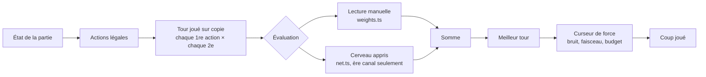

# Vue d'ensemble

## Le problème

Le premier bot était une liste de priorités fixes (vendre, sinon relier, sinon construire…) sans aucune anticipation : il passait ou prenait les jokers dès que rien ne « scorait ». Nicolas voulait un bot qui sache jouer, puis un expert imbattable, puis un expert qui marque énormément à l'ère canal.

## L'architecture en une page

Trois couches, chacune dans son fichier :

| Couche | Fichier | Rôle |
|---|---|---|
| Recherche | `search.ts` | énumère les coups, joue le tour sur une copie, choisit ; règle la force |
| Lecture manuelle | `weights.ts` + `search.ts` | une somme de termes lisibles (points, revenu, argent, retournements probables…) |
| Cerveau | `net.ts`, `net-weights.ts` | un réseau dense qui prédit l'écart de points à la fin de l'ère canal |

Le cerveau ne remplace pas la lecture manuelle : il la **corrige**. Seul, il chute (28 points d'ère canal contre 41 en mélange, voir [[07 Ce qui n'a pas marché]]).

## Les personnages

Quatre personnages, un par couleur : Mr Boulton, Mrs Wedgwood, Mr Watt, Miss Arkwright. Ils partagent le même cerveau et lisent le plateau pareil (les « métiers » par personnage ont été retirés à la demande de Nicolas). Trois d'entre eux jouent au niveau du joueur en face ; **Mr Watt est l'expert** : pleine force, jamais de relâchement.

## Chronologie

| Étape | Gain mesuré |
|---|---|
| Recherche sur le tour complet, évaluation manuelle | 16 victoires sur 16 contre l'ancien bot heuristique |
| Retournement compté avec son revenu, brasseries selon la demande, toutes les paires essayées | la machine par défaut gagne 16/16 contre le champ heuristique |
| Prime aux deux emprunts d'ouverture | +4 points d'ère canal, +7 au final |
| Premier cerveau (94 traits, cible ère canal) | +10 points d'ère canal en auto-jeu |
| Cerveau « ère canal seulement », trio, exploration, 128 traits | expert à 43 / 52 / 50 à 2 / 3 / 4 joueurs contre une table faible |

Suite : [[02 La recherche]].
