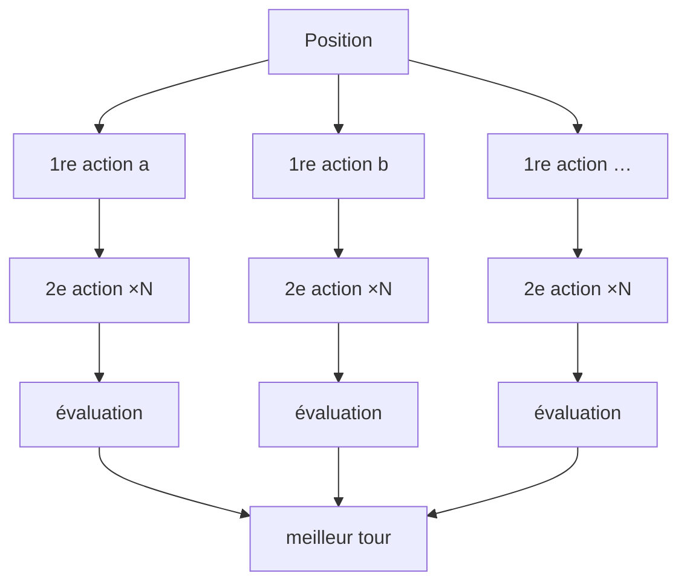

# La recherche

Fichier : `app/src/game/search.ts`.

## Le principe

Le moteur est pur : `applyAction(état, siège, action)` rend un nouvel état sans toucher l'ancien, en 0,5 ms. Une recherche est donc bon marché : on essaie chaque action sur une copie et on regarde le plateau obtenu.

1. **Actions légales** (`legalActions`) : chaque construction une fois, payée avec la carte la moins utile ; chaque liaison, simple ou double (rail) ; les ventes, toutes à la fois et une par une ; les développements, avec le fer du moteur ou celui de sa propre forge ; emprunt, exploration, passe. Tout passe par le moteur : un coup illégal n'existe pas.
2. **Le tour complet** (`searchTurn`) : chaque première action est appliquée, puis chaque seconde. Quand le budget de temps dépasse 1 s, **toutes les paires** sont essayées ; sinon un faisceau des premières actions à moins de 6 points de la meilleure (14 au plus).
3. **La copie allégée** (`bare`) : le journal, l'historique et le log sont retirés de l'état avant la recherche ; ils ne servent pas et alourdissent chaque copie.

## Le curseur de force (`knobs`)

Un seul nombre, de 0 à 1, règle tout :

| Force | Budget | Faisceau | 2e action regardée | Anticipation | Bruit sur les scores |
|---|---|---|---|---|---|
| 0,3 (plancher) | 146 ms | 4 | non | 0 | 2,9 |
| 0,5 (forme de départ à la maison) | 190 ms | 5 | oui | 0 | 1,5 |
| 0,75 | 600 ms | 7 | oui | N+1 | 0,4 |
| 1 (expert) | 1 500 ms | 8 | oui | N+2 | 0 |

Le bruit est tiré d'un dé déterministe fondé sur la position : même table, même « erreur ». Le plancher 0,3 garantit qu'une machine reste cohérente même quand elle se relâche.

## D'où vient la force

- **En ligne** : la cote du meilleur humain de la table (apprenti 0,3 … magnat 1), compte neuf 0,35.
- **À la maison** : une *forme* mémorisée dans le navigateur (`form.ts`), départ 0,5, +0,08 par victoire, −0,05 par défaite, plancher 0,3.
- **En partie** (`adaptiveStrength`) : −0,2 si la machine mène de 12 points sur les humains, −0,35 au-delà de 25, +0,15 si elle est derrière ; plafond 0,5 quand l'assistance débutant est active.
- **Mr Watt** ignore tout cela : force 1.

## L'anticipation (N+1, N+2)

Après le tour, les meilleurs tours sont joués plus loin : les rivaux répondent comme l'heuristique la plus affûtée, avec des mains **tirées au sort** parmi les cartes que personne n'a vues (`determinize`), puis en N+2 la machine rejoue son tour glouton et les rivaux répondent encore. Deux tirages par tour, le résultat pesé à 70 % contre la lecture immédiate.

Mesuré : N+1 a apporté un gain contre des machines sans anticipation ; N+2, N+3, N+4 et le tour planifié n'ont rien ajouté (voir [[07 Ce qui n'a pas marché]]). Depuis que le cerveau est bon, la profondeur n'est plus le levier : c'est [[04 Le cerveau]].

## L'expert dans l'application

- Serveur : budget 1 500 ms par coup, sur le fil principal (à sortir dans un worker si on lui donne la minute autorisée par Nicolas).
- Navigateur : 1 500 ms, sur le fil qui dessine ; un Web Worker est nécessaire avant d'aller plus loin.
