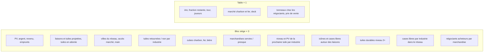
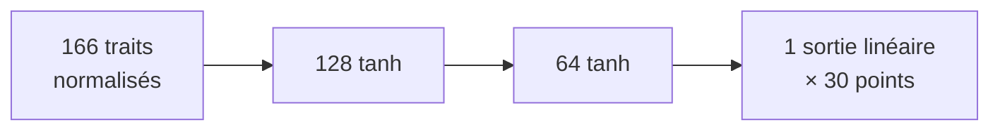

# Le cerveau

Fichiers : `app/src/game/net.ts` (traits, réseau, emballage), `app/src/game/net-weights.ts` (poids appris, une chaîne base64).

## Ce qu'il prédit

Pour un siège, dans une position de l'ère canal : **de combien de points ce siège devancera le meilleur rival au décompte de l'ère canal** (positif devant, négatif derrière), en unités de 30 points. Le réseau n'est consulté que pendant l'ère canal ; le rail est lu à la main.

## Les traits (166 nombres)

Trois blocs de 52 (le siège propre, le rival en tête, la moyenne des rivaux) et 10 traits de table.

Pourquoi ces traits : chaque ajout a suivi une faiblesse observée. Coton I et II rapportent les mêmes points, le réseau ne voyait pas le niveau ; d'où le niveau de la prochaine tuile. Les liaisons se jugent à leurs icônes futures ; d'où les cases libres autour. Les points viennent d'occasions (une case, un acheteur, un tonneau) ; d'où les traits d'opportunité.

## L'architecture

Un **trio** : trois réseaux identiques entraînés depuis trois graines différentes sur les mêmes positions ; la recherche lit la moyenne des trois, plus stable que chacun.

Le premier cerveau était 94 → 64 → 32 → 1, un seul réseau ; le trio est venu quand les positions ont dépassé quelques centaines de milliers.

## L'emballage

Tailles, unité, moyenne et écart-type par trait, puis poids et biais couche par couche, le tout en `Float32` puis en base64 ; les réseaux d'un trio sont joints par une barre. Le fichier `net-weights.ts` fait 170 Ko pour un trio 128×64. Un cerveau dont la taille d'entrée ne correspond pas aux traits du code est **laissé de côté** avec un avertissement, jamais lu de travers.

## Comment il est utilisé

Dans `evaluate()` : `lecture manuelle + cerveau`, en mode « blend ». Le réseau seul (mode « net ») a été mesuré bien plus faible : il n'a pas la structure de la lecture manuelle, il la corrige.

Suite : [[05 La boucle d'auto-jeu]].
