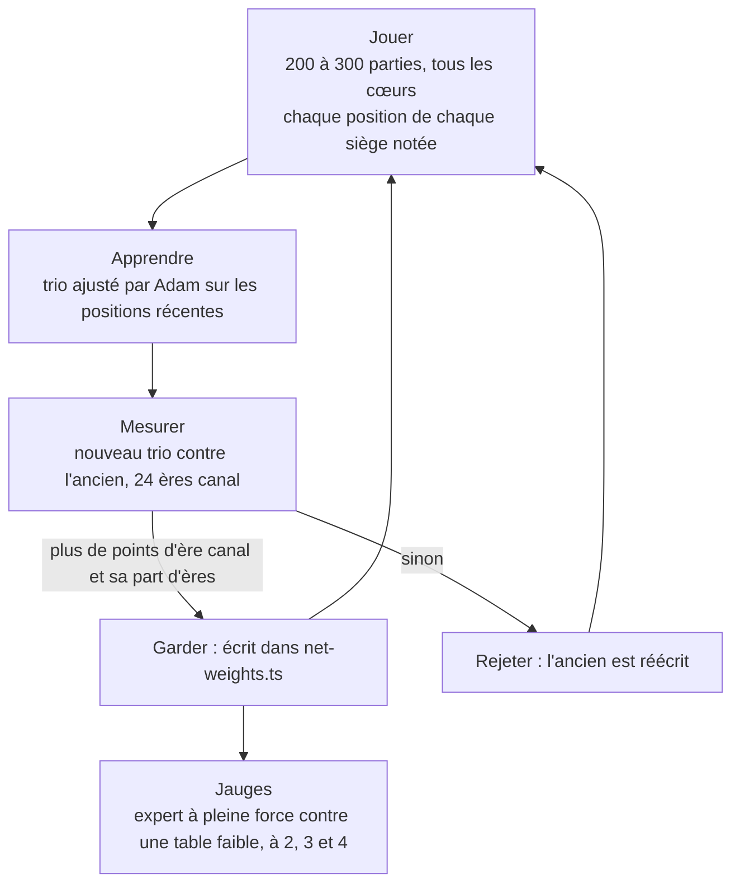

# La boucle d'auto-jeu

Fichier : `app/tools/bots/learn.ts`, lancé par `learn.sh`. L'arène partagée : `arena.ts`.

## Le cycle

## Jouer

- Tables tirées au sort : moitié à quatre, un quart à trois, un quart à deux.
- Les parties **s'arrêtent au décompte de l'ère canal** (à la demande de Nicolas : « arrête-toi à l'ère canal »).
- Pour chaque position et chaque siège, on note les 166 traits, l'écart de points d'ère canal à la fin (la cible), le nombre de sièges et le nombre de positions du même siège qui suivent (pour la cible TD).
- **Exploration** : la moitié des sièges joue un *style*, la lecture manuelle bousculée au hasard (emprunts d'ouverture 0–16, développement 0–6, icônes de liaison, argent, poids du rival, revenu au retournement, marchandises servies). Sans cela, le cerveau ne verrait que la façon de jouer du moment et ne pourrait pas apprendre ce que valent d'autres lignes.
- Force des parties : 0,7 d'abord, puis 1 (la force de l'expert) dans le cycle en cours, pour que les positions soient celles que l'expert rencontre vraiment.

## Apprendre

- Un réseau par graine, trois graines → un trio.
- Adam, lot 512, pas 5·10⁻⁴, légère pénalité des poids, au plus 40 passes.
- **Arrêt anticipé** : on garde la passe qui lit le mieux le jeu de test, et on s'arrête après six passes sans progrès.
- **Jeu de test** : un dixième des positions, en tranches réparties sur tout le fichier (le dernier dixième seul était surtout des parties à deux, aux écarts plus grands : l'erreur de test trompait l'arrêt).
- **Cible TD** : moitié l'issue réelle de l'ère, moitié ce que le trio précédent prédit huit positions plus loin pour le même siège. Cela ôte une partie du hasard des cartes de l'étiquette.
- Le trio n'apprend que sur les 800 000 positions les plus récentes.

## Mesurer et garder

Le nouveau trio joue l'ancien (ou la lecture manuelle s'il n'y en a pas), 24 ères canal à quatre, mêmes graines, même force ; huit ouvriers en parallèle. Il est gardé s'il marque au moins un point d'ère canal de plus **et** gagne au moins sa part des ères. Sinon l'ancien est réécrit dans `net-weights.ts` : la boucle ne peut pas régresser.

## Les jauges

À chaque trio gardé : l'expert à pleine force contre trois (ou un, ou deux) adversaires faibles (lecture manuelle à force 0,3), six ères par table à 2, 3 et 4 joueurs. C'est le chiffre qu'un joueur verra la machine faire. Elles tournent en parallèle sans bloquer le lot suivant.

## Parallélisme et priorité

Douze ouvriers (threads) pour jouer, huit pour mesurer, trois pour les jauges ; le processus tourne en `nice 19` pour laisser la main à Nicolas. Une itération prend six à sept minutes à force 0,7 ; à force 1 les parties sont plus lentes mais l'ère canal seule compense.

## Ce que fait chaque fichier

| Fichier | Rôle |
|---|---|
| `tools/bots/arena.ts` | une partie ou un match : sujet contre champ, lectures et cerveaux différents par camp, arrêt possible au décompte canal |
| `tools/bots/learn.ts` | jouer, apprendre, mesurer, jauger, la boucle |
| `tools/bots/learn.sh` | bundle esbuild + lancement ; variables `GAMES`, `ITERATIONS`, `EPOCHS`, `STRENGTH`, `WORKERS`, `CHECK_GAMES`, `EXPLORE`, `NETS`, `TD`, `FIT_ROWS`, `TARGET` |
| `tools/bots/train.ts`, `train.sh` | l'évolution des poids manuels (mise de côté) |
| `tools/bots/data/` | les positions écrites (`positions-*.f32`), ignorées par git, ~50 Mo par lot |
| `tools/bots/learning.log` | le journal de chaque cycle |

Suite : [[06 Mesures et résultats]].
